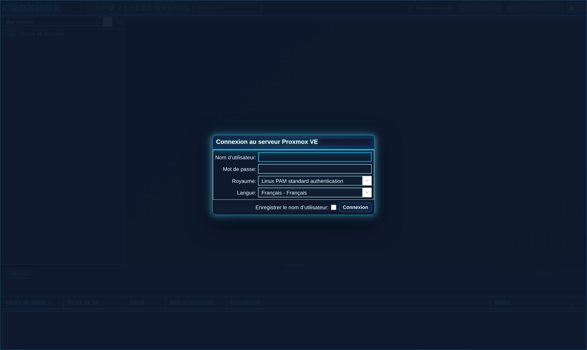
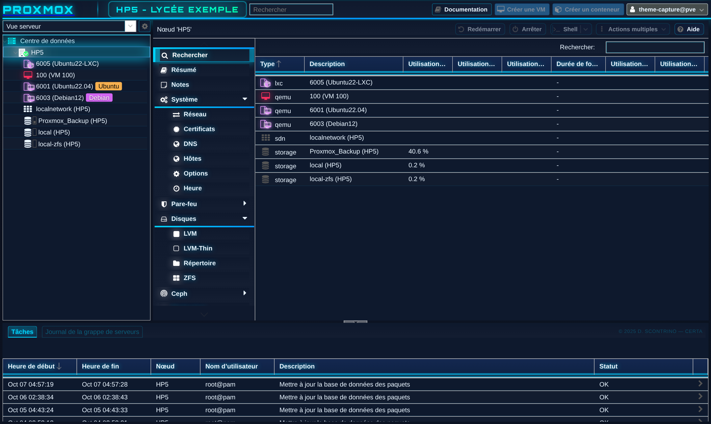

# Proxmox VE — thème néon « cyberpunk »

Thème bleu néon pour l'interface web de **Proxmox VE 8.x et 9.x**, conçu en lycée (BTS SIO) et partagé avec les collègues. Un seul script Bash, **autonome** (police intégrée, rien à télécharger), **interactif** et **réversible** ; nœud seul ou cluster, quel que soit le nom du nœud.





### Ce qu'il fait
- fond sombre animé, icônes colorées selon l'état (VM arrêtée, en marche, modèle), menus, fenêtres
  et graphiques assortis ;
- un **badge** dans la barre du haut (nom du nœud par défaut, texte au choix) ;
- options pédagogiques **désactivées par défaut** : message d'accueil après la connexion, « clone
  intégral » imposé aux comptes non administrateurs, retrait de la fenêtre « No valid subscription ».

### Ce qu'il modifie (et rien d'autre)
- une ligne `<link>` dans `index.html.tpl` (repérée par une marque, jamais en double) ;
- une feuille de style dédiée (police Orbitron intégrée au script) ;
- un crochet APT qui **réapplique le thème après une mise à jour** de Proxmox ;
- `pvemanagerlib.js` et `ext6-pve.css` ne sont **pas** touchés ; aucun redémarrage de service.

### Installation
```bash
chmod +x install_theme_proxmox.sh
./install_theme_proxmox.sh          # en root : menu interactif
```
Le menu propose : installer / mettre à jour, désinstaller, afficher l'état, simulation (ne modifie
rien), retirer une ancienne version. Rafraîchir ensuite le navigateur (**Ctrl+F5**).

### Désinstallation
Menu → « Désinstaller » : le script retire ce qu'il a ajouté, puis **vérifie** que chaque fichier
de Proxmox est redevenu identique à celui du paquet Debian (empreinte md5 de dpkg).

📄 Guide d'une page avec captures : [`guide_theme_proxmox.pdf`](guide_theme_proxmox.pdf)

---

## Licence

- Scripts, guide et captures : **[CC BY-NC-SA 4.0](LICENSE)** — usage non commercial, attribution,
  partage dans les mêmes conditions.
- Police **Orbitron** (intégrée au thème) : © 2018 The Orbitron Project Authors,
  [SIL Open Font License 1.1](OFL-Orbitron.txt).

## Auteur

Damien SCONTRINO — BTS SIO, lycée Louis Armand (Nogent-sur-Marne).
Retours et suggestions bienvenus via les *issues* du dépôt.
